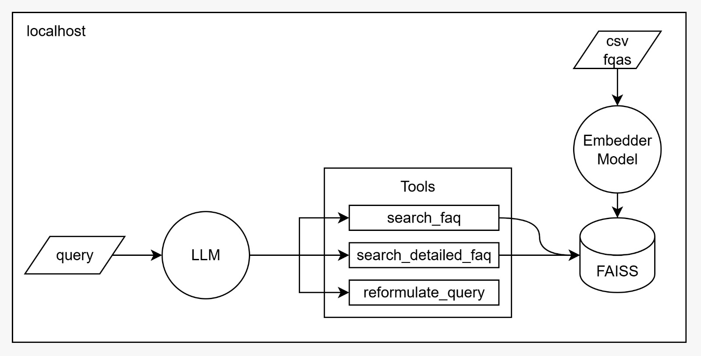

Build, deploy, and scale enterprise-grade AI agents with security and control using Amazon Bedrock AgentCore.

Architcture:

Stack:
- Use Groq as the LLM provider.
- Use HuggingFace as the embedding model provider.
- Use FAISS as the vector store.
- Use UV as the package manager.
- Use AWS Bedrock as the cloud provider.
- Use LangGraph as the agent framework with ReAct pattern.
- Use RAG pattern for knowledge retrieval.
- Use AWS Bedrock AgentCore as the agent mesh deployment platform.